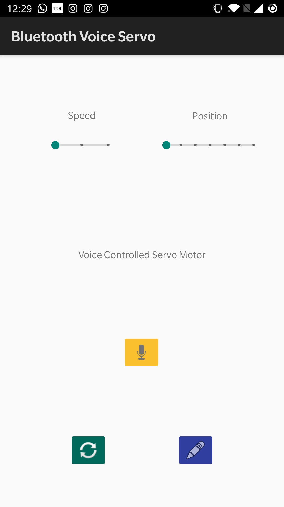

# BluetoothVoiceServo
Android Application code for voice controlled servo motor via Bluetooth. 

## Voice Command list:-
Key= ASCII char
### Position Commands-
"position 0 degrees" - Sends key '0'
"position 30 degrees" - Sends key '1'
"position 60 degrees" - Sends key '2'
"position 90 degrees" - Sends key '3'
"position 120 degrees" - Sends key '4'
"position 150 degrees" - Sends key '5'
"position 180 degrees" - Sends key '6'

### Speed Commands- 
"Valet Mode" - Sends key '7'
"Ludicrous Mode" - Sends key '8'
"Light Speed Ahead" - Sends key '9'
## Screenshot
Below is a screenshot of the app layout and elements.

 Main Activity with 2 slider inputs, a voice button and special switch for Dance Mode. 

## Acknowledgements
This application was built as part of the coursework for ENGN8537:Embedded Systems and Real Time DSP major project.  
